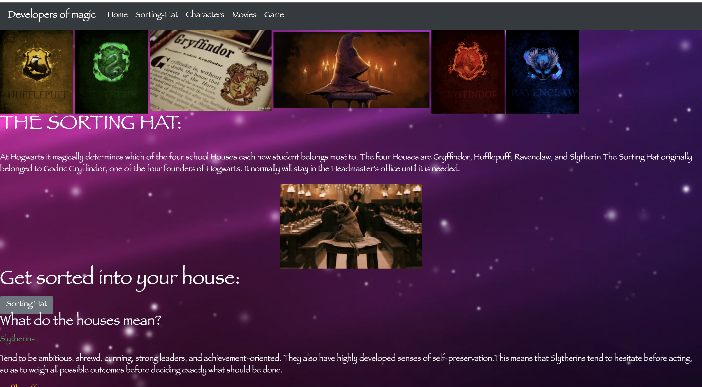
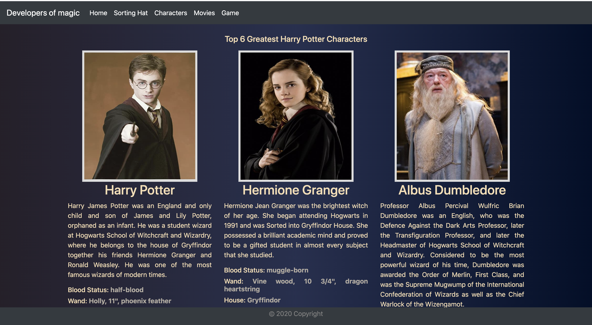

# movie-api.2
.  This site was to created to give the user spark notes on the JK Rowlings Harry Potter series. 

.  Motivation for development? 
The motivation behind this was although some have not seen or read the series they can still join in on the fun and get a taste of the magic the series has to offer.

. The user of our site could be a long loving fan of the series or someone who has no idea what the series is. Our site is for everyone and anyone to join in on the fun!

Our website was developed in:
. HTML Semantic tag
. BootStrap Framework version 4.5.2
. Jquery version 3.5.1
. Javascript
.We use two api keys Potterapi, as well as OMDb Api

. We used JSON to get information from the Potter Api for the sorting hat, characters as well as  houses, with different routes and the same key.

. Our movies page as well use JSON to get information from OMDb Api where you can sort the movies and check the facts, images, plot and rating etc.

.Our site is responsive and the NavBar will go into a hamburger navbar once screen is minimized

Website Examples:

